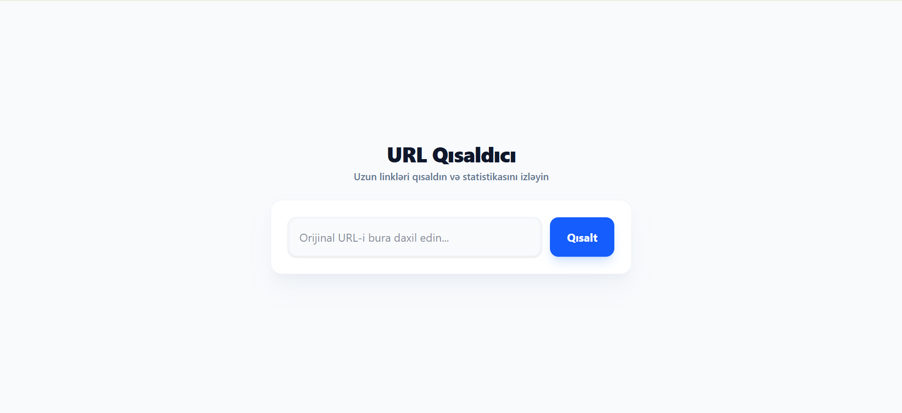
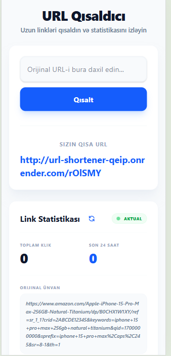

# 🔗 URL Qısaldıcı (URL Shortener)

Müasir, sürətli və premium dizayna malik URL qısaltma tətbiqi. Bu layihə həm **Frontend** (React), həm də **Backend** (Node.js/Express) hissələrindən ibarətdir.

## 📸 Ekran Görüntüləri


*Şəkil 1: Layihənin ana səhifəsi və mərkəzləşdirilmiş premium dizaynı.*


*Şəkil 2: Real-vaxt statistika izləmə bölməsi.*

## 🌍 Canlı Demo (Deployment)

Layihə hal-hazırda aşağıdakı platformalarda canlı olaraq işləyir:

- **Frontend:** [Vercel](https://vercel.com) üzərində yerləşdirilib.
- **Backend:** [Render](https://render.com) üzərində yerləşdirilib.

## ✨ Özəlliklər

- **Sürətli Qısaltma:** Uzun URL-ləri saniyələr içində qısaldın.
- **Canlı Statistika:** Hər bir link üçün toplam klik sayını və son 24 saatdakı aktivliyi izləyin.
- **Qalıcı Yaddaş:** `localStorage` vasitəsilə səhifəni yenilədikdə belə məlumatlarınız itmir.
- **Premium Dizayn:** Tailwind CSS 4 ilə hazırlanmış müasir, mərkəzləşdirilmiş və mobil uyğun (responsive) interfeys.
- **Təhlükəsizlik:** Rate limiting ilə serverin həddindən artıq yüklənməsinin qarşısı alınır.

## 🛠 Texnologiyalar

### Frontend:
- **React (Vite):** Sürətli və modulyar UI.
- **Tailwind CSS 4:** Müasir stillər və animasiyalar.
- **Axios:** API sorğuları üçün.

### Backend:
- **Node.js & Express:** Sürətli server infrastrukturu.
- **Nanoid:** Unikal və yığcam kod yaradılması.
- **Validator:** URL-lərin doğruluğunun yoxlanılması.
- **ES Modules:** Tam modern JavaScript standartı.

## 🚀 Quraşdırma və İşə Salma

Layihəni lokal maşınınızda işə salmaq üçün aşağıdakı addımları izləyin:

### 1. Backend-i işə salın
```bash
cd backend
npm install
npm run dev
```
*Server susmaya görə `http://localhost:5000` ünvanında işə düşəcək.*

### 2. Frontend-i işə salın
```bash
cd frontend
npm install
npm run dev
```
*İnterfeys `http://localhost:5173` (və ya Vite tərəfindən verilən digər port) ünvanında açılacaq.*

## 🧪 Test Nümunələri (API)

Layihənin işləməsini aşağıdakı `curl` əmrləri ilə terminaldan test edə bilərsiniz:

### 1. URL Qısaltmaq (POST)
```bash
curl -X POST http://localhost:5000/api/shorten \
     -H "Content-Type: application/json" \
     -d '{"url": "https://google.com"}'
```
*Gözlənilən cavab: `{"shortUrl": "http://localhost:5000/abcde"}`*

### 2. Statistika Almaq (GET)
```bash
curl http://localhost:5000/api/stats/{kod}
```
*Gözlənilən cavab: `{"originalUrl": "https://google.com", "totalClicks": 1, ...}`*

### 3. Rate Limit Testi
Eyni linki 5 dəfədən çox qısaltmağa çalışsanız server sizə **429 Too Many Requests** xətası qaytaracaq.

## 📂 Layihə Strukturu

- `/backend`: Server kodları, marşrutlar və servislər.
- `/frontend`: React komponentləri, stillər və konfiqurasiya.
- `/frontend/src/config.js`: API ünvanının mərkəzi tənzimləmə faylı.

## 📝 Qeydlər
- Layihənin düzgün işləməsi üçün həm frontend, həm də backend eyni vaxtda işlək vəziyyətdə olmalıdır.
- Qısa linklər bazada deyil, müvəqqəti olaraq serverin yaddaşında (in-memory) saxlanılır (Server söndükdə sıfırlanır).

---
